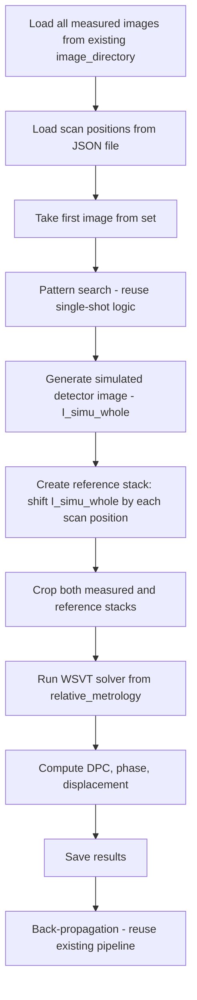

# WSVT Absolute Phase — Implementation Plan

## Overview

Add a WSVT (Wavelet Speckle Vector Tracking) multi-image scanning mode to the existing `absolute_phase` module. This mode handles a set of images where the mask is scanned across multiple positions, generating simulated reference datasets from the mask pattern to perform WSVT analysis.

**GUI approach**: WSVT is added as another method option in the existing method field (alongside WXST, SPINNet, simple). The existing `image_directory` field is reused — when WSVT is selected, all files from that directory are loaded automatically. Only a few new inputs are needed: scan positions file, number of scans, auto-sign checkbox, and sign overrides.

## Algorithm Flow



### Key Difference from Relative Metrology WSVT
- In relative metrology: reference images are **real measured images** loaded from a folder
- In absolute phase WSVT: reference images are **simulated** from the mask pattern, then shifted according to scan positions to create a synthetic reference stack

### Key Difference from Single-Shot Absolute Phase
- Single-shot: one measured image → one simulated reference → WXST/SPINNet speckle tracking
- WSVT: N measured images at N scan positions → N simulated references shifted by scan positions → WSVT solver

## Resolved Design Decisions

1. **Scan positions file format**: JSON file with structure `{"position": [[x1, x2, ...], [y1, y2, ...]]}` — positions in physical units (mm or m, controlled by `position_units`)
2. **Image shifting method**: `scipy.ndimage.shift` with `mode='nearest'`
3. **WSVT solver**: Directly import `WSVT` from `relative_metrology/legacy/WSVT.py` — no duplication
4. **Back-propagation**: Existing pipeline works on WSVT results — no changes needed
5. **GUI approach**: WSVT is just another method option — no separate tab, no separate image folder, no separate result folder
6. **Sign convention**: Auto-detected by default using `phase_cross_correlation` between first two images. When measured and expected shifts have the same sign (product > 0), sign = -1; when opposite, sign = +1. Manual override via `sign_x`/`sign_y` when `auto_sign` is disabled.
7. **Three-level caching**: `propagated_pattern.npz` → `propagated_patternDet.npz` → `simulated_ref_stack.npz` — controlled by `process_after_mask` flag
8. **No per-image normalization**: Unlike single-shot, WSVT stacks are NOT normalized per-image (this destroys inter-frame intensity variation the WSVT solver relies on)
9. **Global alignment only**: Single alignment from first frame, same shift applied to all reference frames (no per-image `image_align()`)

## Architecture

### Approach: Extend Existing Module

The new WSVT mode is added **within** the existing `absolute_phase` module, following the same pattern used by `relative_metrology` (which has WXST and WSVT coexisting).

### Files Created (Step 1 — COMPLETED ✅)

| File | Purpose | Status |
|------|---------|--------|
| `legacy/process_images_WSVT_executor.py` | Executor: loads images, generates simulated reference stack, runs WSVT solver, saves results | ✅ Done |
| `tests/test_wsvt_absolute_phase.py` | Standalone test script calling executor directly | ✅ Done |
| `tests/test_wxst_absolute_phase.py` | Standalone test script for single-shot WXST comparison | ✅ Done |

### Executor Parameters (`execute_process_images_WSVT`)

The executor accepts these keyword arguments (with defaults):

**Data paths:**
- `image_directory` — folder with measured images (TIF/HDF5 files)
- `scan_positions_file` — JSON file with scan positions
- `data_directory` — base data directory (contains `absolute_phase/Au_delta.npy` etc.)
- `result_folder` — output folder (default: `./results`)
- `pattern_path` — mask pattern file (default: `./mask/RanMask5umB0.npy`)
- `propagated_pattern` — path to cached propagated pattern, or None to compute
- `propagated_patternDet` — path to cached propagated pattern at detector, or None
- `simulated_ref_stack` — path to cached reference stack npz, or None
- `process_after_mask` — if True, continue processing; if False, stop after saving simulation data
- `saving_path` — directory for saving simulation data

**Scan parameters:**
- `n_scan` — number of scan positions to use (default: 51)
- `sign_x`, `sign_y` — sign convention for x/y (default: 1)
- `auto_sign` — auto-detect sign from first two images (default: True)
- `position_units` — units of positions in JSON: "mm" or "m" (default: "mm")

**Optics parameters:**
- `p_x`, `det_res`, `energy`, `pattern_size`, `pattern_thickness`, `pattern_T`
- `d_prop`, `d_source_v`, `d_source_h`, `source_v`, `source_h`, `propagator`

**Pattern search parameters:**
- `correct_scale`, `show_alignFigure`, `d_source_recal`, `estimation_method`
- `img_transfer_matrix`, `find_transferMatrix`

**Image processing:**
- `crop`, `dark`, `flat`, `rebinning`, `lineWidth`

**WSVT solver parameters:**
- `cal_half_window` (default: 20), `n_cores` (default: 4), `n_group` (default: 1)
- `use_wavelet`, `wavelet_lv_cut`, `pyramid_level`, `n_iter`
- `use_GPU`, `scaling_x`, `scaling_y`

**Output control:**
- `verbose`, `save_images`

### Files to Modify (Step 2 — Phase 2 Integration)

| File | Change Type | Description |
|------|-------------|-------------|
| `facade.py` | Add method | Add `process_images_WSVT()` abstract method |
| `absolute_phase_analyzer.py` | Add method + config | Add WSVT ini parameters + `store()` updates + `process_images_WSVT()` method + `_process_images_WSVT()` function |
| `gui/absolute_phase_manager_initialization.py` | Add WSVT config | Add WSVT parameters to config dict and reverse mapping |
| `gui/absolute_phase_manager.py` | Add WSVT handler | Route "Process Image" to WSVT when method is "WSVT" |
| `gui/absolute_phase_widget.py` | Add WSVT inputs | Add "WSVT" to method options, add conditional WSVT inputs, wire up callbacks |

### Files NOT Modified

| File | Reason |
|------|--------|
| `legacy/process_images_executor.py` | Existing single-shot processing stays untouched |
| `legacy/WXST_simplified.py` | Existing WXST solver stays untouched |
| `legacy/back_propagation_executor.py` | Back-propagation is independent of tracking method |
| `legacy/diffraction_process.py` | Diffraction utilities stay untouched |
| `factory.py` | Factory already returns `AbsolutePhaseAnalyzer` which will have the new method |

## Detailed Implementation Steps

### Step 1: Create `legacy/process_images_WSVT_executor.py` — ✅ COMPLETED

Created and debugged the core executor with:
- Three-level caching system
- Auto-sign detection using `phase_cross_correlation`
- Global alignment (first frame only, same shift for all reference frames)
- No per-image normalization (preserves inter-frame variation for WSVT solver)
- Output matching original executor format (`ProcessImageResult.to_dict()`)
- `d_source_recal` support
- Sign detection info saved to `result.json`

### Step 2: Add `process_images_WSVT()` to Facade

Add to `IAbsolutePhaseAnalyzer` in `facade.py`:
```python
@abc.abstractmethod
def process_images_WSVT(self, data_collection_directory: str = None, **kwargs): raise NotImplementedError
```

### Step 3: Add WSVT Config + Method to Analyzer

In `absolute_phase_analyzer.py`:

**New module-level globals** (WSVT section):
```python
# WSVT
WSVT_SCAN_POSITIONS_FILE = ini_file.get_string_from_ini( section="WSVT", key="Scan-Positions-File", default=None)
WSVT_N_SCAN              = ini_file.get_int_from_ini(    section="WSVT", key="N-Scan",              default=51)
WSVT_AUTO_SIGN           = ini_file.get_boolean_from_ini(section="WSVT", key="Auto-Sign",           default=True)
WSVT_SIGN_X              = ini_file.get_int_from_ini(    section="WSVT", key="Sign-X",              default=1)
WSVT_SIGN_Y              = ini_file.get_int_from_ini(    section="WSVT", key="Sign-Y",              default=1)
WSVT_POSITION_UNITS      = ini_file.get_string_from_ini( section="WSVT", key="Position-Units",      default="mm")
```

**Add to `store()`**:
```python
# WSVT
ini_file.set_value_at_ini(section="WSVT", key="Scan-Positions-File", value=WSVT_SCAN_POSITIONS_FILE)
ini_file.set_value_at_ini(section="WSVT", key="N-Scan",              value=WSVT_N_SCAN)
ini_file.set_value_at_ini(section="WSVT", key="Auto-Sign",           value=WSVT_AUTO_SIGN)
ini_file.set_value_at_ini(section="WSVT", key="Sign-X",              value=WSVT_SIGN_X)
ini_file.set_value_at_ini(section="WSVT", key="Sign-Y",              value=WSVT_SIGN_Y)
ini_file.set_value_at_ini(section="WSVT", key="Position-Units",      value=WSVT_POSITION_UNITS)
```

**New method on `AbsolutePhaseAnalyzer`**:
```python
def process_images_WSVT(self, data_collection_directory=None, **kwargs):
    return _process_images_WSVT(
        data_collection_directory=self.__data_collection_directory if data_collection_directory is None else data_collection_directory,
        file_name_prefix=self.__file_name_prefix,
        mask_directory=self.__simulated_mask_directory,
        energy=self.__energy,
        **kwargs)
```

**New module-level function `_process_images_WSVT()`**: Builds kwargs from globals and calls `execute_process_images_WSVT()`.

### Step 4: Update Manager Initialization

In `absolute_phase_manager_initialization.py`:

**Add to `data_analysis_configuration` dict** in `generate_initialization_parameters_from_ini()`:
```python
"wsvt_scan_positions_file": wa.WSVT_SCAN_POSITIONS_FILE,
"wsvt_n_scan": wa.WSVT_N_SCAN,
"wsvt_auto_sign": wa.WSVT_AUTO_SIGN,
"wsvt_sign_x": wa.WSVT_SIGN_X,
"wsvt_sign_y": wa.WSVT_SIGN_Y,
"wsvt_position_units": wa.WSVT_POSITION_UNITS,
```

**Add to `set_ini_from_initialization_parameters()`**:
```python
wa.WSVT_SCAN_POSITIONS_FILE = data_analysis_configuration["wsvt_scan_positions_file"]
wa.WSVT_N_SCAN = data_analysis_configuration["wsvt_n_scan"]
wa.WSVT_AUTO_SIGN = data_analysis_configuration["wsvt_auto_sign"]
wa.WSVT_SIGN_X = data_analysis_configuration["wsvt_sign_x"]
wa.WSVT_SIGN_Y = data_analysis_configuration["wsvt_sign_y"]
wa.WSVT_POSITION_UNITS = data_analysis_configuration["wsvt_position_units"]
```

### Step 5: Update Manager

In `absolute_phase_manager.py`:

**Update `process_image()` method** to detect when method is "WSVT" and route accordingly:
```python
def process_image(self, initialization_parameters: ScriptData):
    self.__set_absolute_phase_analyzer_ready(initialization_parameters)

    absolute_phase_analyzer_configuration = initialization_parameters.get_parameter('absolute_phase_analyzer_configuration')
    data_analysis_configuration = absolute_phase_analyzer_configuration['data_analysis']
    method = data_analysis_configuration.get('method', 'WXST')

    if method == "WSVT":
        return self.__absolute_phase_analyzer.process_images_WSVT(
            use_dark=initialization_parameters.get_parameter("use_dark", False),
            use_flat=initialization_parameters.get_parameter("use_flat", False),
            save_images=initialization_parameters.get_parameter("save_images", True),
        )
    else:
        # existing single-shot logic (unchanged)
        ...
```

### Step 6: Update GUI Widget

In `absolute_phase_widget.py`:

**Update method label** (line 405):
```python
gui.lineEdit(wa_box_6, self, "method", label="Method (WXST, SPINNet(SD), simple, WSVT)", ...)
```

**Add conditional WSVT inputs** (after the method field):
```python
self._wsvt_box = gui.widgetBox(wa_box_6, "", width=wa_box_6.width() - 20, orientation='vertical')

wsvt_scan_box = gui.widgetBox(self._wsvt_box, "", orientation='horizontal')
gui.lineEdit(wsvt_scan_box, self, "wsvt_scan_positions_file", "Scan Positions File", orientation='horizontal', valueType=str)
gui.button(wsvt_scan_box, self, "...", width=30, callback=self._set_wsvt_scan_positions_file)

gui.lineEdit(self._wsvt_box, self, "wsvt_n_scan", label="Number of Scans", ...)
gui.checkBox(self._wsvt_box, self, "wsvt_auto_sign", "Auto-detect Sign Convention")
gui.lineEdit(self._wsvt_box, self, "wsvt_sign_x", label="Sign X (+1 or -1)", ...)
gui.lineEdit(self._wsvt_box, self, "wsvt_sign_y", label="Sign Y (+1 or -1)", ...)
gui.lineEdit(self._wsvt_box, self, "wsvt_position_units", label="Position Units (mm or m)", ...)
```

**Update `_set_method()` callback**: Add "WSVT" to valid methods, toggle `_wsvt_box` visibility.

**Update `_set_delta_f()`**: Add "WSVT" to valid methods.

**Update `_set_values_from_initialization_parameters()`**: Read WSVT fields from config.

**Update `_collect_initialization_parameters()`**: Write WSVT fields to config.

## Implementation Order

### Phase 1: Core Algorithm + Testing — ✅ COMPLETED
1. ✅ `legacy/process_images_WSVT_executor.py` — core algorithm
2. ✅ `tests/test_wsvt_absolute_phase.py` — standalone test script
3. ✅ `tests/test_wxst_absolute_phase.py` — single-shot comparison test

### Phase 2: Integration + GUI — ✅ COMPLETED
4. ✅ `facade.py` — added `process_images_WSVT()` abstract method
5. ✅ `absolute_phase_analyzer.py` — added WSVT ini globals, `store()` entries, class method, module-level `_process_images_WSVT()` function
6. ✅ `gui/absolute_phase_manager_initialization.py` — added WSVT parameters to config dict and reverse mapping
7. ✅ `gui/absolute_phase_manager.py` — added WSVT routing in `process_image()` and `_process_images_WSVT()` helper
8. ✅ `gui/absolute_phase_widget.py` — added WSVT instance variables, conditional GUI inputs (scan positions file, n_scan, auto_sign, sign_x/y, position_units), method validation, visibility toggles, file browser callback, and config collection

## GUI Changes Summary

The GUI changes are minimal:

1. **Method field label**: Update from `"Method (WXST, SPINNet(SD), simple)"` to `"Method (WXST, SPINNet(SD), simple, WSVT)"`
2. **Method validation**: Add `"WSVT"` to valid methods in `_set_method()` and `_set_delta_f()`
3. **Conditional inputs**: Add a `_wsvt_box` containing:
   - Scan positions file path with "..." browse button (JSON file selector)
   - Number of scans (integer)
   - Auto-sign checkbox (boolean, default True)
   - Sign X (+1 or -1) — manual override when auto-sign is disabled
   - Sign Y (+1 or -1) — manual override when auto-sign is disabled
   - Position units (mm or m)
4. **Visibility toggle**: `_wsvt_box.setVisible(self.method == "WSVT")` — called from `_set_method()` callback
5. **Image loading**: When method is "WSVT", the existing `image_directory` is used — all files from that directory are loaded automatically by the executor
6. **Process routing**: The existing "Process Image" button routes to WSVT processing when method is "WSVT"

No separate WSVT tab, no separate image folder input, no separate result folder input.

## Scan Positions File Format

JSON file with the following structure:
```json
{
    "position": [
        [-0.006, 0.006, -0.0025, ...],
        [0.0025, 0.00075, -0.007, ...]
    ]
}
```

Where `position[0]` is the list of x-shifts and `position[1]` is the list of y-shifts, both in physical units (mm by default, controlled by `position_units`). These are converted to pixel shifts by dividing by `pixel_size` (after unit conversion if needed).

## Post-Completion Bug Fixes

### Bug Fix 1: Missing `os.makedirs` for `saving_path` — ✅ FIXED
**Symptom**: "Cannot find simulated pattern" error when clicking "Process Image" with WSVT.
**Root cause**: The WSVT executor never created the `saving_path` directory before trying to save files there.
**Fix**: Added `os.makedirs(saving_path, exist_ok=True)` after `saving_path` is determined in the executor.

### Bug Fix 2: Missing `speckle_shift` in `reference.json` — ✅ FIXED
**Symptom**: Back-propagation fails with KeyError for `speckle_shift`.
**Root cause**: The WSVT executor's `reference.json` only contained `image_transfer_matrix`, `n_scan`, `sign_x`, `sign_y`, `crop` — missing the `speckle_shift` key required by `back_propagation_executor.py`.
**Fix**: Added `'speckle_shift': pos_shift.tolist()` to the `write_json` call, and added a copy of `reference.json` from `saving_path` to `result_folder` in the cache-load branch.

### Bug Fix 3: Missing reference displacement offset in post-processing — ✅ FIXED
**Symptom**: Final phase results depend heavily on initial source distance guess (`d_source_v`, `d_source_h`). Different initial guesses produce significantly different phase results, when they should be similar.
**Root cause**: The WSVT executor's post-processing (Step 7) only computed phase from the *residual* displacement (WSVT solver output), without adding back the reference wavefront's displacement field (`displace_x_offset`, `displace_y_offset`). In contrast, the WXST executor adds these offsets inside `speckle_tracking()` at lines 730-731, 767-768, 810-811, 900-901.
**Fix**: Three changes in `process_images_WSVT_executor.py`:
1. **Fresh computation branch**: Apply `boundary_crop()` to offset variables directly (keeping them in scope) before saving to `simulated_ref_stack.npz`
2. **Cache-load branch**: Load `displace_x_offset` and `displace_y_offset` from `simulated_ref_stack.npz`
3. **Post-processing (Step 7)**: Crop offsets by `cal_half_window` (to match WSVT solver output shape), mean-subtract, and add to displacement before computing DPC and phase:
```python
hw = args.cal_half_window
displace_y_offset_cropped = displace_y_offset[hw:-hw, hw:-hw]
displace_x_offset_cropped = displace_x_offset[hw:-hw, hw:-hw]
displace_y_offset_cropped = displace_y_offset_cropped - np.mean(displace_y_offset_cropped)
displace_x_offset_cropped = displace_x_offset_cropped - np.mean(displace_x_offset_cropped)
displace_x += displace_x_offset_cropped
displace_y += displace_y_offset_cropped
```
**Note**: After this fix, previously cached `simulated_ref_stack.npz` files should be regenerated (the offset arrays are now stored in boundary-cropped form).
